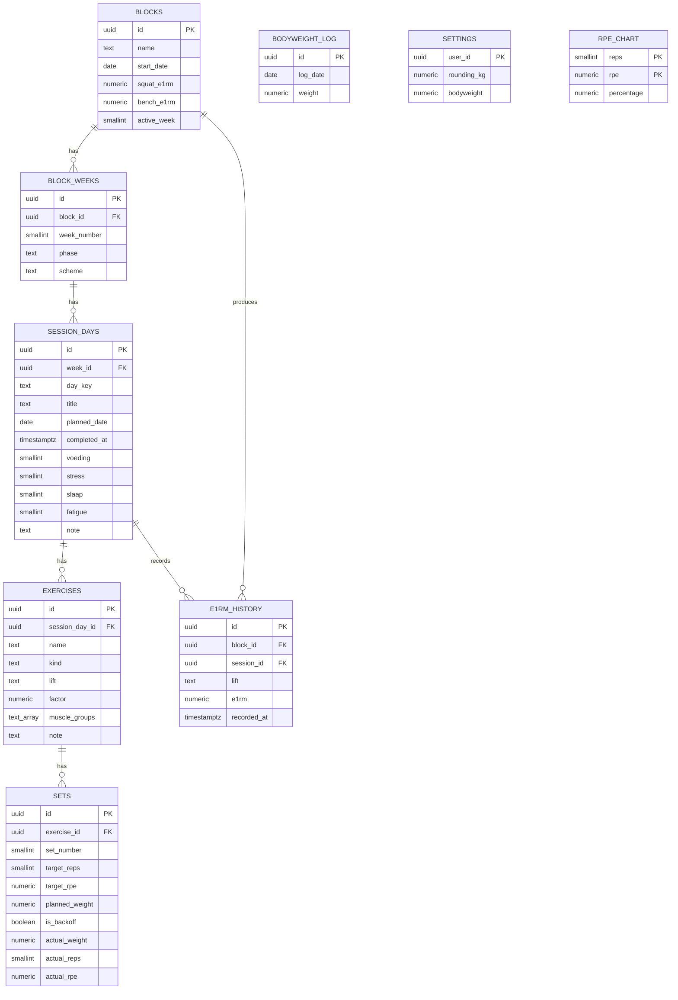

# Untamed Strength — Architectuur

Persoonlijke kracht- & hypertrofie-trainingsapp. Vervangt de Excel-sheet
"Untamed Strength". Eén gebruiker, lokaal-first, geen auth.

## 1. Tech stack

| Laag | Keuze |
|------|-------|
| Framework | Next.js 16 (App Router, `src/`, TypeScript) |
| Styling | Tailwind CSS v4 + shadcn-stijl componenten (`src/components/ui`) |
| Grafieken | Recharts (`src/components/charts.tsx`) |
| State | Zustand + `persist` → IndexedDB (`idb-keyval`) |
| Formulieren | React Hook Form (Program Builder) |
| Opslag (huidig) | **Lokaal** in de browser (IndexedDB) + JSON export/import |
| Opslag (optioneel later) | Supabase / PostgreSQL — schema in `supabase/migrations` |

De volledige domeinlogica is pure TypeScript en backend-onafhankelijk:
`src/lib/{rpe,periodization,adaptive,analytics,insights,templates}.ts`.

## 2. Datamodel (ERD)



In de lokaal-first app leeft ditzelfde model als één genest JSON-document
(zie `src/lib/types.ts` → `AppData`), opgeslagen onder de IndexedDB-sleutel
`untamed-strength`.

## 3. Pagina-architectuur (App Router)

| Route | Bestand | Doel |
|-------|---------|------|
| `/` | `app/page.tsx` | Dashboard: stats, huidig blok, e1RM/volume/RPE-grafieken |
| `/builder` | `app/builder/page.tsx` | Program Builder: 5-wekenblok genereren uit e1RM's |
| `/train` | `app/train/page.tsx` | Blokoverzicht: weken + dagen, sessie openen |
| `/session/[dayId]` | `app/session/[dayId]/page.tsx` | Trainingstabel, loggen, readiness, adaptief, e1RM-dialog |
| `/progress` | `app/progress/page.tsx` | e1RM, lichaamsgewicht, readiness, RPE-chart |
| `/volume` | `app/volume/page.tsx` | Sets per spiergroep + tonnage/intensiteit per week |
| `/insights` | `app/insights/page.tsx` | Regelgebaseerde feedback |
| `/calendar` | `app/calendar/page.tsx` | Voltooide / geplande / gemiste trainingen |
| `/settings` | `app/settings/page.tsx` | Lichaamsgewicht, afronding, export/import, reset |

## 4. Componentstructuur

```
src/
  app/                     # routes (zie boven)
  components/
    app-shell.tsx          # sidebar + responsive nav + hydration gate
    page-header.tsx        # PageHeader + EmptyState
    charts.tsx             # Recharts wrappers (line/area/bar)
    ui/                    # shadcn-stijl primitives
      button, card, input, label, badge, table,
      dialog, tabs, select, stat
  lib/
    types.ts               # domeintypes
    rpe.ts                 # RPE-chart, e1RM, gewichtsberekening, afronden
    templates.ts           # 4-daagse split + spiergroepen
    periodization.ts       # 5-weken generator + recompute future weeks
    adaptive.ts            # RPE-vergelijking → voorstel + e1RM-detectie
    analytics.ts           # volume, e1RM-series, readiness-score
    insights.ts            # feedbackregels
    format.ts, utils.ts
  store/
    useAppStore.ts         # Zustand store + acties
    idb-storage.ts         # IndexedDB adapter voor persist
```

## 5. API-endpoints (optionele Supabase-variant)

De lokaal-first app heeft geen API nodig. Bij overstap naar Supabase volstaat
de auto-gegenereerde PostgREST/RPC-laag; aanbevolen route-handlers:

| Methode | Route | Actie |
|---------|-------|-------|
| `GET` | `/api/blocks` | Lijst blokken |
| `POST` | `/api/blocks` | Nieuw blok genereren (body: naam, squatE1rm, benchE1rm) |
| `GET` | `/api/blocks/:id` | Blok met weken/dagen/oefeningen/sets |
| `PATCH` | `/api/blocks/:id` | activeWeek of e1RM's bijwerken (+ recompute) |
| `DELETE` | `/api/blocks/:id` | Blok verwijderen |
| `PATCH` | `/api/sets/:id` | Werkelijk gewicht/reps/RPE loggen |
| `POST` | `/api/sessions/:id/complete` | Sessie afronden → e1RM-records |
| `GET` | `/api/e1rm?lift=squat` | e1RM-historie voor grafieken |
| `POST` | `/api/bodyweight` | Lichaamsgewicht loggen |

Server-side rekenlogica hergebruikt dezelfde `src/lib`-functies.

## 6. Kernformules

- **RPE-chart**: `% = 100 − 4·(10 − RPE) − f(reps)` (zie `rpe.ts`).
- **Trainingsgewicht**: `e1RM × factor × % / 100`, afgerond op 2,5 kg.
- **e1RM uit set**: `gewicht / (% / 100) / factor`.
- **Readiness (0–100)**: voeding + slaap positief, stress + fatigue invers.
- **Adaptief**: Δ = werkelijke RPE − doel-RPE → ±2,5 kg (Δ≥1) of ±5 kg (Δ≥2).
